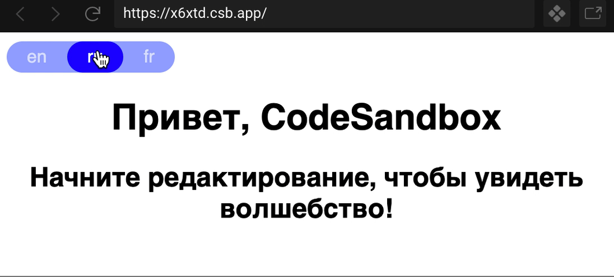

# Usage with React

## React hook `useLocalizify`

You can see live demo: https://codesandbox.io/s/naughty-wu-x6xtd



### Step-by-step tutorial

1. Create `localizify` folder with 3 files: `useLocalizify.js` (hook), `LocalizifyContext.js` (context) and `bootstrap.js` (translations will be loaded, current locale will be set in this file).

2. In `bootstrap.js` you should load translations and set a current locale. You can store the locale anywhere, for example in `localStorage` (see example below): 

Load the locale from `localStorage`. If the locale isn't set, try to detect the locale from a browser and by default set a locale to `en`.

```js
const locale = localStorage.locale || l8y.detectLocale() || "en";
```

Don't forget save next locale to `localStorage` using `onLocaleChange` method:

```js
l8y.onLocaleChange(nextLocale => {
    localStorage.locale = nextLocale;
});
```

Sum up:

```js
// bootstrap.js

import localizify, { Instance } from "localizify";

export function initLocalizify() {
  const ru = {
    "Hello, {name}": "Привет, {name}",
    "Start editing to see some magic happen!":
      "Начните редактирование, чтобы увидеть волшебство!"
  };
  const en = {
    "Hello, {name}": "Hello, {name}",
    "Start editing to see some magic happen!":
      "Start editing to see some magic happen!"
  };
  const fr = {
    "Hello, {name}": "bonjour, {name}",
    "Start editing to see some magic happen!":
      "Commencez à éditer pour voir un peu de magie se produire!"
  };

  const locale = localStorage.locale || localizify.detectLocale() || "en";
  const l8y = new Instance();

  l8y
    .add("en", en)
    .add("ru", ru)
    .add("fr", fr)
    .setLocale(locale);

  l8y.onLocaleChange(nextLocale => {
    console.log(`onLocaleChange in bootstrap, nextLocale: ${nextLocale}`);
    localStorage.locale = nextLocale;
  });

  return l8y;
}
```

3. `LocalizifyContext.js` contains a React context object where stores localizify instance to use in application. I recommend use own instance of localizify instead of using global object.

```js
import React from "react";

export const LocalizifyContext = React.createContext(null);
```

4. `useLocalizify.js` provides a React Hook:

```js
import { useContext, useState, useEffect } from "react";
import { LocalizifyContext } from "./LocalizifyContext";

export function useLocalizify() {
  const localizify = useContext(LocalizifyContext);

  if (!localizify) {
    throw new Error("Missing <LocalizifyContext.Provider>");
  }

  const { locale, localesList } = localizify.getStore();
  const [currentLocale, setCurrentLocale] = useState(locale);
 
  // subscribe to next locale once
  useEffect(() => {
    localizify.onLocaleChange(nextLocale => {
      console.log(`onLocaleChange in hook, nextLocale: ${nextLocale}`);
      setCurrentLocale(nextLocale);
    });
  }, [localizify]);

  // add shortalias for translate method
  localizify.t = localizify.translate;

  // localizify methods aren't bounded, so do it in hook
  for (const prop in localizify) {
    if (typeof localizify[prop] === "function") {
      localizify[prop] = localizify[prop].bind(localizify);
    }
  }

  return {
    ...localizify,
    currentLocale,
    localesList
  };
}
```

5. Wrap your application to <LocalizifyContext.Provider>:

```diff
import React from "react";
import ReactDOM from "react-dom";
+ import { LocalizifyContext } from "./localizify/LocalizifyContext";
+ import { initLocalizify } from "./localizify/bootstrap";

import App from "./App";

+ const localizify = initLocalizify();

const rootElement = document.getElementById("root");
ReactDOM.render(
+  <LocalizifyContext.Provider value={localizify}>
    <App />
+  </LocalizifyContext.Provider>,
  rootElement
);
```

6. Use hook in your components:

```diff
import React from "react";
+ import { useLocalizify } from "./localizify/useLocalizify";

export default function App() {
+  const { t } = useLocalizify();

  return (
    <div className="app">
-      <h1>Hello, CodeSandbox</h1>
+      <h1>{t("Hello, {name}", { name: "CodeSandbox" })}</h1>
-      <h2>Start editing to see some magic happen!</h2>
+      <h2>{t("Start editing to see some magic happen!")}</h2>
    </div>
  );
}
```

7. Add LangSwitcher:

```js
import React from "react";
import { useLocalizify } from "./localizify/useLocalizify";

export default function LangSwitcher() {
  const { setLocale, localesList, currentLocale } = useLocalizify();

  return (
  <div className="language-switcher">
    {localesList.map(locale => (
      <div
        key={locale}
        onClick={() => setLocale(locale)}
        className={locale === currentLocale ? "active" : ""}
      >
        {locale}
      </div>
    ))}
  </div>
  );
}
```

## Deprecated (for react v15)

You can see example in [spring-mvc-react](https://github.com/noveogroup-amorgunov/spring-mvc-react) example repository.

First, create a language switcher component:

```javascript
import React from 'react';
import localizify, { t } from 'localizify';

const LanguageSwitcher = React.createClass({
  getClass(locale) {
    return localizify.getLocale() === locale ? 'active' : '';
  },

  onChangeLocale(event) {
    const element = event.target;
    if (element.className !== 'active') {
      const locale = element.textContent.toLowerCase();
      localStorage.locale = locale;
      location.reload(); // reload page
    }
  },

  render() {
    return (
      <div>
        <span onClick={this.onChangeLocale} className={this.getClass('en')}>EN</span>
        <span onClick={this.onChangeLocale} className={this.getClass('fr')}>FR</span>
      </div>
      
    );
  }
});

export default LanguageSwitcher;
```

Set locale in init appication file:

```javascript
import localizify from 'localizify';

// load messages (e.g. usign webpack and json-loader)
import en from './messages/en.json';
import fr from './messages/fr.json';

const locale = localStorage.locale || localizify.detectLocale() || 'en';

localizify
  .add('en', en)
  .add('fr', fr)
  .setLocale(locale);

```

And using in any component:

```javascript
import { t } from 'localizify';
import React from 'react';

import LanguageSwitcher from './language-switcher';

var Component = React.createClass({
  render() {
    return (
      <div>
        {t('hello world')}
        <LanguageSwitcher />
      </div>
    );
  }
});

export default Component;
```
